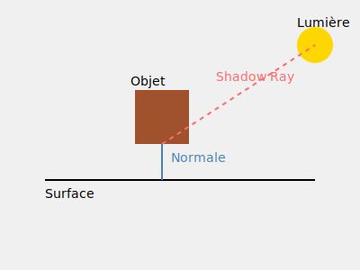

# Documentation Technique du Système d'Éclairage
## Vue d'ensemble du système d'éclairage

Le système d'éclairage implémente le modèle de Phong modifié, offrant un rendu réaliste des surfaces 3D. Il combine trois composantes principales pour simuler différentes interactions lumière-matière.

## Structure de base

### Classe Light
```rust
struct Light {
    position: Vec3,    // Position de la source lumineuse
    intensity: f64     // Intensité (0.0 à 1.0)
}
```

## Composantes de l'éclairage

### 1. Éclairage Ambiant
- **Objectif**: Simuler la lumière indirecte dans l'environnement
- **Implémentation**:
```rust
let ambient_strength = 0.1;
let ambient = hit_record.color.mul(ambient_strength);
```
- **Caractéristiques**:
  - Niveau de base constant (10%)
  - Illumination minimale des zones sombres
  - Indépendant de la position de la source

### 2. Éclairage Diffus
- **Objectif**: Simuler la réflexion de la lumière sur des surfaces mates
- **Implémentation**:
```rust
let light_direction = shadow_ray_direction.normalize();
let diff = normal.dot(&light_direction).max(0.0);
let diffuse = hit_record.color.mul(diff * light.intensity);
```
- **Caractéristiques**:
  - Suit la loi de Lambert (cosinus)
  - Intensité basée sur l'angle d'incidence
  - Dépend de la normale à la surface

### 3. Réflexions Spéculaires
- **Objectif**: Créer des reflets brillants sur les surfaces
- **Implémentation**:
```rust
let view_direction = hit_record.point.mul(-1.0).normalize();
let reflect_direction = reflect(&light_direction.mul(-1.0), &normal);
let spec = reflect_direction.dot(&view_direction)
    .max(0.0)
    .powf(shininess);
```
- **Paramètres clés**:
  - `specular_strength`: Intensité des reflets (0.5 = 50%)
  - `shininess`: Concentration du reflet (32.0 par défaut)

## Gestion des Ombres

### Système de Ray Casting
```rust
let shadow_ray = Ray {
    origin: hit_record.point.add(&hit_record.normal.mul(0.001)),
    direction: shadow_ray_direction.normalize()
};
```

### Détection des obstacles
```rust
if let Some(_shadow_hit) = world.hit(&shadow_ray, 0.001, shadow_ray_distance) {
    return hit_record.color.mul(0.1);
}
```

### Caractéristiques importantes:
- Offset de 0.001 pour éviter l'auto-intersection
- Retour à l'éclairage ambiant en cas d'ombre
- Test des obstacles jusqu'à la source lumineuse

## Calculs Mathématiques Clés

### 1. Normalisation des vecteurs
- **Objectif**: Garantir des calculs cohérents
- **Usage**: 
```rust
direction: shadow_ray_direction.normalize()
```

### 2. Produit Scalaire (dot)
- **Objectif**: Mesurer les angles entre vecteurs
- **Usage**:
```rust
normal.dot(&light_direction).max(0.0)
```

### 3. Réflexion (reflect)
- **Objectif**: Calculer la direction de réflexion
- **Formule**: R = V - 2(V·N)N
  - V: Direction incidente
  - N: Normale à la surface
  - R: Direction réfléchie

## Intégration dans la Scène

### Configuration des Lumières
```rust
let lights = vec![
    Light::new(Vec3::new(5.0, 5.0, -3.0), 0.8),
    Light::new(Vec3::new(-3.0, 3.0, -2.0), 0.6)
];
```

### Calcul de l'Éclairage Final
1. Parcours de toutes les sources lumineuses
2. Accumulation des contributions
3. Combinaison des trois composantes

## Optimisations Possibles

### 1. Performance
- Cache des calculs de normalisation
- Pré-calcul des directions lumineuses
- Parallélisation des calculs

### 2. Qualité
- Support des lumières colorées
- Ajout d'atténuation avec la distance
- Implémentation de soft shadows

## Limitations Actuelles
- Pas de support pour les lumières directionnelles
- Ombres dures uniquement
- Pas de réflexions multiples

## Annexes

### Formules Mathématiques Clés
1. Éclairage diffus: Id = kd(N·L)
2. Éclairage spéculaire: Is = ks(R·V)^n
3. Éclairage total: I = Ia + Id + Is

### Glossaire
- **Normal**: Vecteur perpendiculaire à la surface
- **Shininess**: Exposant spéculaire
- **Ray Casting**: Technique de lancer de rayons
- **Dot Product**: Produit scalaire entre vecteurs

# Guide de Contrôle de la Luminosité dans le Ray Tracer

## Paramètres Principaux de Luminosité

### 1. Intensité de la Lumière
Pour ajuster la luminosité globale de la scène, vous pouvez modifier l'intensité des sources lumineuses :

```rust
Light::new(
    Vec3::new(5.0, 5.0, -5.0), // Position
    0.8,                       // Intensité (modifiez cette valeur)
)
```

L'intensité peut être ajustée entre 0.0 et 1.0 :
- 0.0 : Aucune lumière
- 0.5 : Intensité moyenne
- 1.0 : Intensité maximale

## Exemples de Configuration

### Scène Lumineuse avec deux luminosités
```rust
let ambient_strength = 0.2;
let specular_strength = 0.7;
let lights = vec![
    Light::new(Vec3::new(5.0, 5.0, -5.0), 0.9),
    Light::new(Vec3::new(-5.0, 5.0, -3.0), 0.7),
];
```

### Scène Sombre
```rust
let ambient_strength = 0.05;
let specular_strength = 0.3;
let lights = vec![
    Light::new(Vec3::new(5.0, 5.0, -5.0), 0.4),
];
```

### Scène Équilibrée
```rust
let ambient_strength = 0.1;
let specular_strength = 0.5;
let lights = vec![
    Light::new(Vec3::new(5.0, 5.0, -5.0), 0.8),
    Light::new(Vec3::new(-5.0, 5.0, -3.0), 0.6),
];
```


# Documentation du Système d'Ombres





## Vue d'ensemble du Système

Le système d'ombres implémenté dans ce ray tracer utilise la technique du shadow ray (rayon d'ombre) pour déterminer si un point est dans l'ombre. Cette méthode simule le comportement naturel de la lumière en vérifiant si des objets bloquent le chemin entre un point et une source lumineuse.

## Implémentation Détaillée

### Création du Shadow Ray

```rust
let shadow_ray_direction = light.position.sub(&hit_record.point);
let shadow_ray_distance = shadow_ray_direction.length();
let shadow_ray = Ray {
    origin: hit_record.point.add(&hit_record.normal.mul(0.001)),
    direction: shadow_ray_direction.normalize(),
};
```

#### Paramètres Clés
- `origin` : Point de départ légèrement décalé de la surface
- `direction` : Vecteur normalisé pointant vers la source lumineuse
- `shadow_ray_distance` : Distance jusqu'à la source lumineuse

### Vérification des Ombres

```rust
if let Some(_shadow_hit) = world.hit(&shadow_ray, 0.001, shadow_ray_distance) {
    return hit_record.color.mul(0.1);
}
```

#### Paramètres de Détection
- `0.001` : Distance minimale pour éviter l'auto-intersection
- `shadow_ray_distance` : Distance maximale de recherche
- `0.1` : Facteur d'assombrissement pour les zones d'ombre

## Aspects Techniques Importants

### Offset de Surface
L'offset de 0.001 unités (`normal.mul(0.001)`) est crucial pour :
- Éviter les artefacts d'acné d'ombre
- Prévenir les auto-intersections
- Assurer une détection précise des ombres

### Distance de Test
La vérification entre `0.001` et `shadow_ray_distance` permet de :
- Ignorer les objets derrière la source lumineuse
- Optimiser les calculs d'intersection
- Obtenir des ombres précises

## Ajustements et Optimisations

### Intensité des Ombres
Pour modifier l'obscurité des zones d'ombre :
```rust
return hit_record.color.mul(0.1); // Modifiez cette valeur
```
- 0.0 : Ombres totalement noires
- 0.1 : Ombres douces (valeur par défaut)
- 0.2 : Ombres plus claires

### Précision de Détection
Pour ajuster la précision de la détection :
```rust
world.hit(&shadow_ray, 0.001, shadow_ray_distance) // Modifiez le 0.001
```
- Diminuer : Plus précis mais risque d'acné d'ombre
- Augmenter : Moins précis mais plus stable

## Bonnes Pratiques

### Performance
1. Utilisez des structures d'accélération pour les tests d'intersection
2. Limitez le nombre de sources lumineuses
3. Optimisez la distance de test pour chaque rayon d'ombre

### Qualité Visuelle
1. Ajustez l'offset de surface selon l'échelle de votre scène
2. Équilibrez l'intensité des ombres avec l'éclairage ambiant
3. Considérez l'ajout de soft shadows pour plus de réalisme

## Résolution des Problèmes Courants

### Artefacts d'Ombre
Si vous observez des points noirs ou des motifs étranges :
1. Augmentez légèrement l'offset de surface
2. Vérifiez la normalisation des vecteurs
3. Ajustez les distances minimales et maximales de test

### Ombres Manquantes
Si certaines ombres ne s'affichent pas :
1. Vérifiez les distances de test
2. Confirmez la direction du shadow ray
3. Assurez-vous que tous les objets sont testés pour l'intersection

## Extensions Possibles

### Soft Shadows
Pour améliorer le réalisme, vous pourriez :
1. Implémenter des sources lumineuses surfaciques
2. Utiliser plusieurs shadow rays par point
3. Moyenner les résultats pour des ombres douces

### Optimisations Avancées
Considérez l'implémentation de :
1. Hiérarchies de volumes englobants (BVH)
2. Tests d'intersection précoces
3. Parallélisation des calculs d'ombre
