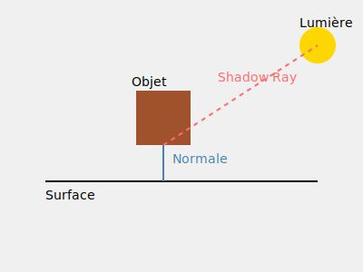

Éclairage Ambiant (ambient)

C'est la lumière de base présente partout
ambient_strength = 0.1 signifie que 10% de la couleur est toujours visible
Formule : ambient = color * ambient_strength


Éclairage Diffus (diffuse)


Dépend de l'angle entre la normale et la direction de la lumière
Plus la surface fait face à la lumière, plus elle est éclairée
Formule : diffuse = color * (normal · light_direction) * intensity


Éclairage Spéculaire (specular)


Crée les reflets brillants
Dépend de l'angle entre la direction de vue et la réflexion de la lumière
shininess contrôle la taille du reflet
Formule : specular = white * (view · reflection)^shininess * specular_strength


Calcul des Ombres (shadow ray)


Un rayon est lancé du point vers la source de lumière
Si ce rayon rencontre un objet, le point est dans l'ombre
Dans l'ombre, seule la composante ambiante est gardée

Les paramètres clés :
```rust
rustCopyambient_strength = 0.1    // Force de l'éclairage ambiant
specular_strength = 0.5   // Intensité des reflets
shininess = 32.0         // Concentration des reflets
```
Les vecteurs importants :
normal : Perpendiculaire à la surface
light_direction : Du point vers la lumière
view_direction : Du point vers la caméra
reflect_direction : Direction de réflexion de la lumière

# Shadow Ray Explanation

